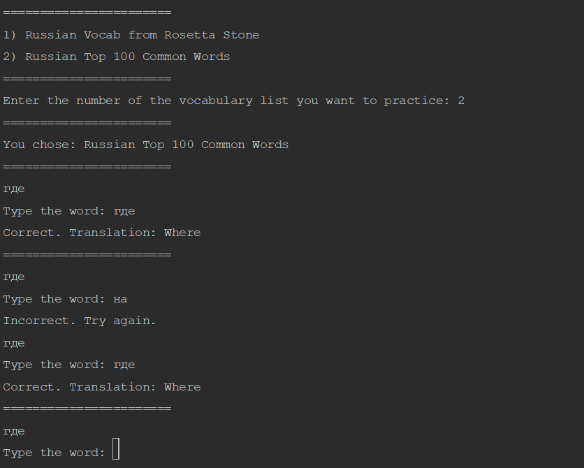

# LangLearn

LangLearn, short for "Language Learner", is a tool designed to
assist in learning a new language. It is similar to flash cards,
where a word is presented and you must type it out.

## Project Home Page

Visit the project page on DevDungeon.com for more information.

https://www.github.com/DevDungeon/LanguageLearner
https://www.devdungeon.com/content/langlearner

## Screenshot

## Installation

    pip install langlearn
    
Or download this package as a zip file and install with setup.py 

    python setup.py install
    
## Running

    langlearn --help
    
    langlearn
    
    langlearn <custom-vocab-file>
         
## Contact

nanodano@devdungeon.com

